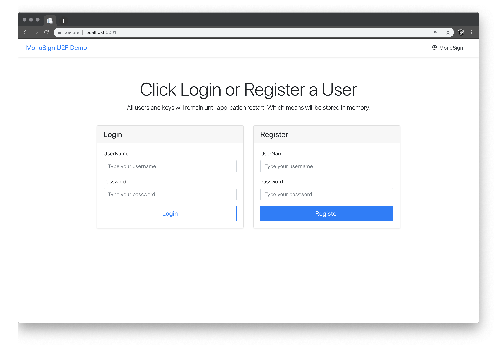
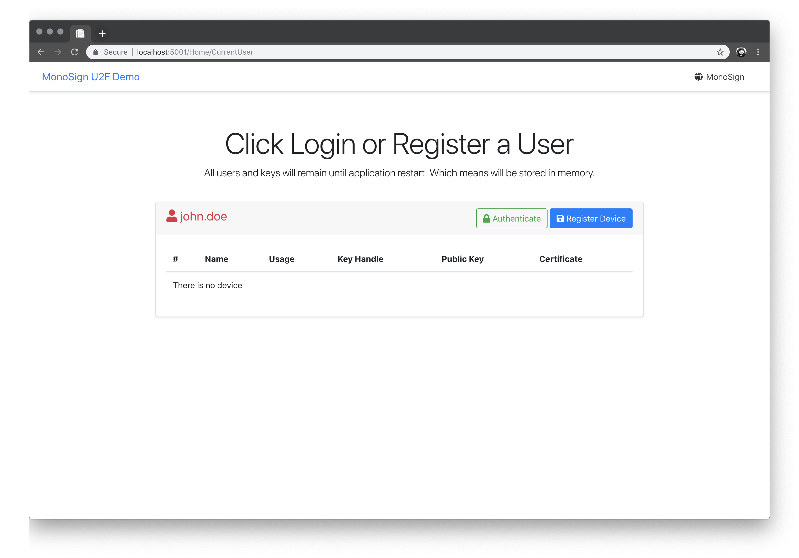
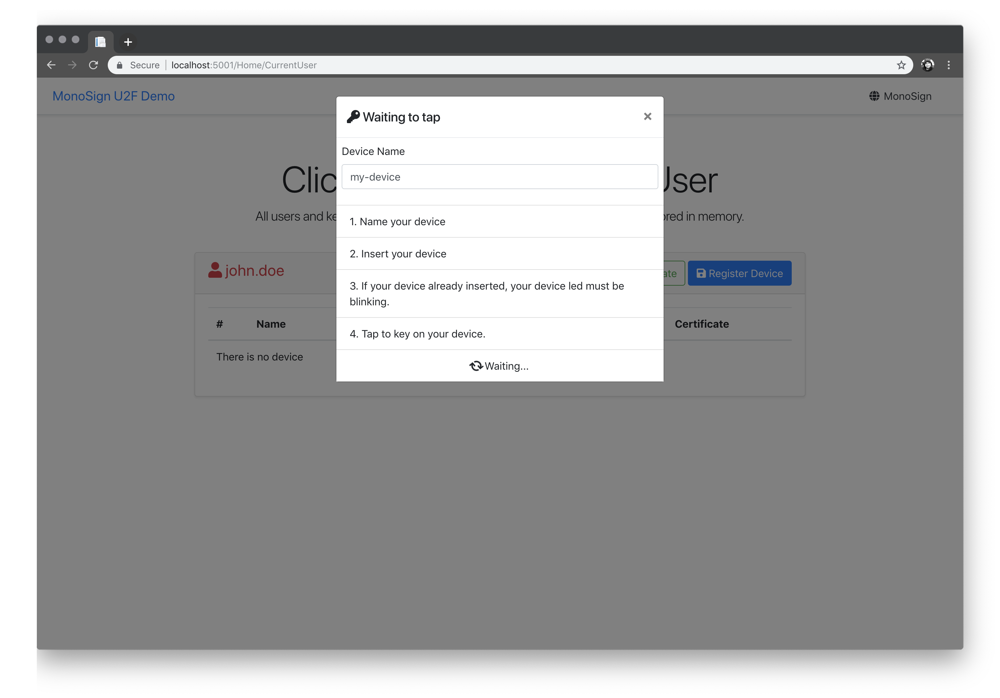
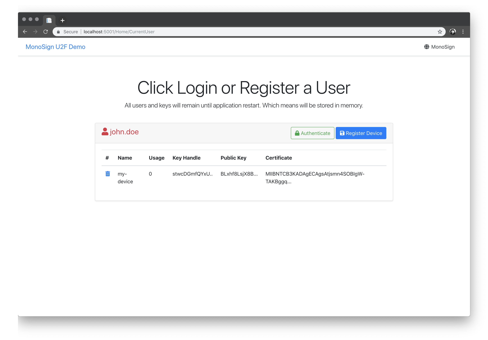
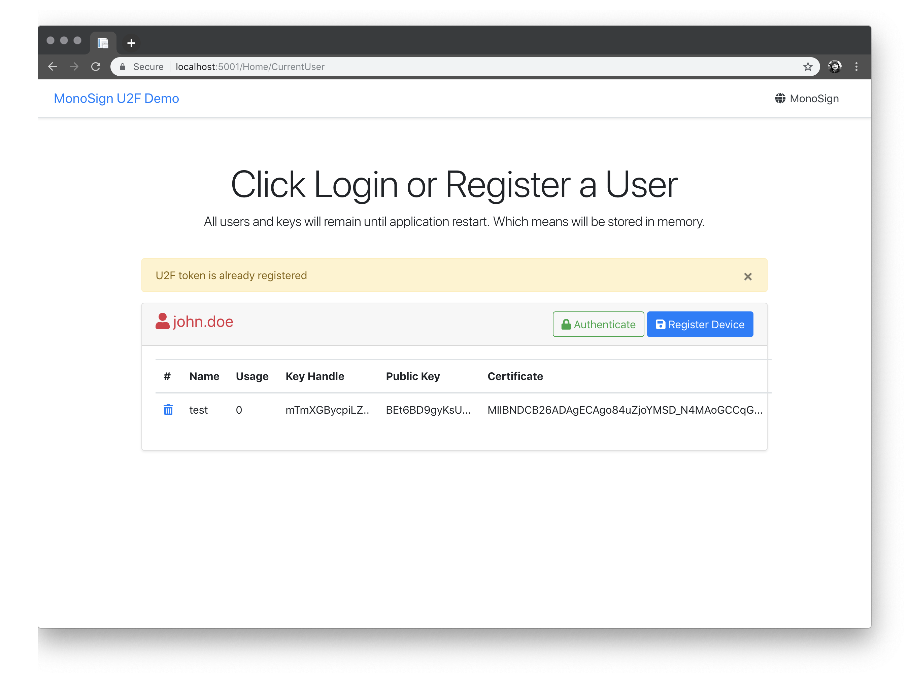
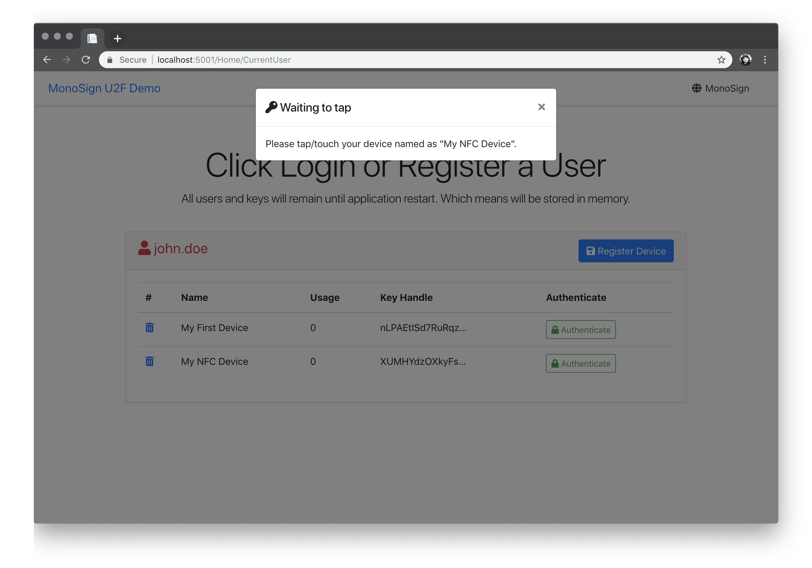
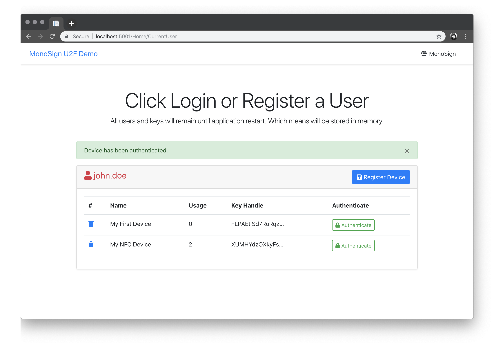

### MonoSign U2F dotnet core



This library will help you to authenticate users with U2F (FIDO) device.

This proje also uses BouncyCastle for certification actions on dotnet core.

### Demo Project

Demo project is just testing purpose. Do not use it on production.

#### Supported Options

- User Register
- User Login
- Device Register
- Device Authentication
- Device Remove
- Device Duplication Check
- Device Name Duplication Check

### What about Nuget Packages?

You can find the package on nuget;

[](https://www.nuget.org/packages/MonoSign.U2F/)

```sh
dotnet add package MonoSign.U2F
```

### Screenshots

#### Main

#### User

#### Register

#### Registered Device

#### Already Registered

#### Authenticate

#### Already Registered



### FIDO Universal 2nd Factor (U2F) for C# .NET

This project forked from [@hanswolff](https://github.com/hanswolff) 's project named as "https://github.com/hanswolff/fido-u2f-net". All namespaces are changed and maintained by MonoSign Team now. Thank you for bringing this project and help us to understand more.

### License, Usage, Contribution

Feel free to use, change, update and please PR if you did better things on project.
